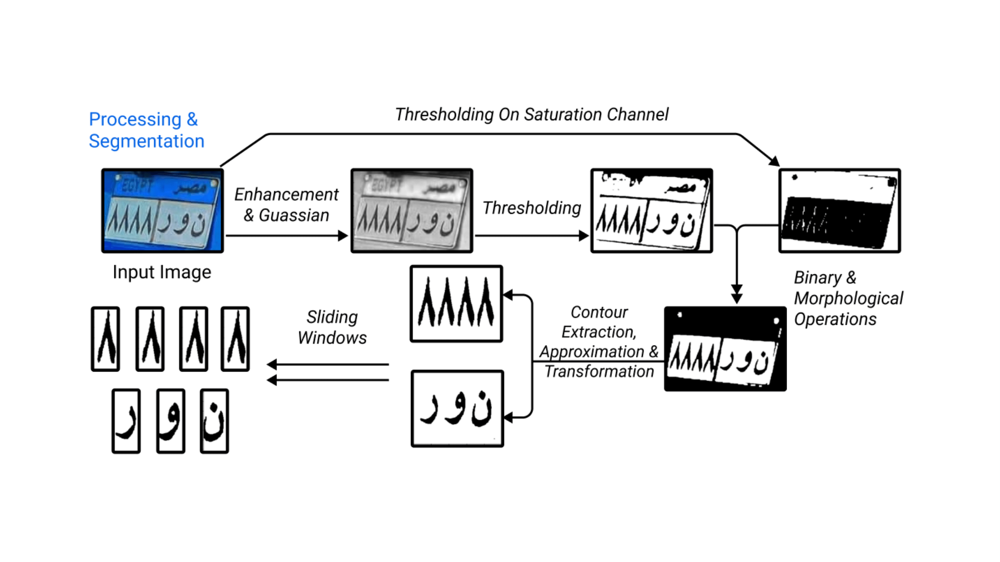

# Transformers
## Arabic licence plate recognition :car:
- Solution to the kaggle competition [Machathon 3.0](https://www.kaggle.com/competitions/machathon-3/overview).
- Ranked in the top :six: at the final evaluation phase.
- Check our solution now on [collab](https://colab.research.google.com/drive/15LM0YL0Yi3KdwhPBrGH_G3iGkx6eT5XZ?usp=sharing)!
- Check the solution [presentation](https://docs.google.com/presentation/d/1oKDeQLSAw4cRpJk1M4o6nnwFDsDRIpsHaDYuUuWA6oc/edit?usp=sharing)
## Preprocessing Pipeline

## Approach
### Step1: Preprocessing Enhancments on the image.
- Most images had bad illumination and noise
  - Morphological operations to Maximize Contrast.
  - Gaussian Blur to remove Noise.
- Thresholding on both Value and Saturation channels.

### Step2: Extracting white plate using countours.
- Get countours and sort based on Area.
- Polygon Approximation For noisy countours.
- Convex hull for Concave polygons.
- 4-Point transformation For difficult camera angles. 

Now have numbers in a countor and letters in another.

### Step3: Separating characters from white plate using sliding windows.
Can't use countours to get symbols in white plate since Arabic Letter may consist of multiple charachters 
e.g ت  this may consist of 2/3 countours.
#### Solution
- Tuned 2 sliding windows, one for letters' white plate, the other for numbers.
  - Variable window width
  - Window height is the white plate height, since arabic characters may consist multiple parts
- Selecting which window 
  - Must have no black pixels on the sides
  - Must have a specific range of black pixels inside
  - For each group of windows the one with max black pixels is selected

### Step4: Character Recognition.
- Training 2 model since Arabic letters and numbers are similar e.g (أ,1) (5, ه)
  - one for classifing only arabic letters.
  - one for classifying arabic numbers.

## Project Structure
### Scripts applied on images
- extract_bbx_xml.ipynb 
  - Takes directory of images and their bbx data stored in an xml files, and crop the bbxs from the images.
  - The xml file contains licence label(name), xmin, ymin, xmax, ymax of the bbxs in an image.
- extract_bbx_txt.ipynb 
  - Takes directory of images and their bbx data stored in a txt files, and crop the bbxs from the images.
  - The txt file corresponding to one image may consist of multiple bbxs, each corresponds to a row of xmin,ymin,xmax,ymax for that bbx.
- crop_right_noise
  - Crops an image with some percentage and replace with the cropped image.
### Model versions
- model.ipynb
  - The preprocessing and modeling stage
  - Contains:
    - Preprocessing Functions
    - Training both classifers
    - Prediction and generating the output csv file

### Data Folder
- challenging_images.rar
  - Most challenging images collected from the train data.
- cropped_letters.zip
  - 28 Subfolders corresponding to the 28 letter in Arabic alphabet.
  - Each subfolder holds images for the letter it's named after, cropped from the train data distribution.
- cropped_numbers.zip
  - 10 Subfolders for the 10 numbers.
  - Each subfolder holds images for the number it's named after, cropped from the train data distribution.
- machathon-3.zip
  - The uploaded data found with the kaggle competition.
- testLetters.zip
  - 200 images labeled from the test data distribution.
  - each image has a corresponding xml file holding the bbxs locations in it.

## Contributors
### This masterpiece was designed, and implemented by
<table align="center">
  <tr>
    <td align="center">
    <a href="https://github.com/hoskillua" target="_black">
    
     
    <b>Hossam Saeed</b></a>
    </td>
    <td align="center">
    <a href="https://github.com/Mostafa-wael" target="_black">
    
     
    <b>Mostafa Wael</b></a>
    </td>
    <td align="center">
    <a href="https://github.com/NadaElmasry" target="_black">
    
     
    <b>Nada Elmasry</b></a>
    </td>
    <td align="center">
    <a href="https://github.com/NouranHany" target="_black">
    
     
    <b>Noran Hany</b></a>
    </td>
  </tr>
 </table>
